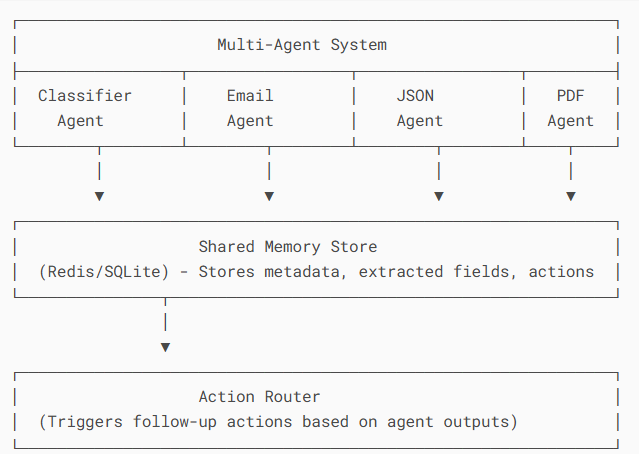

# Multi-Format Autonomous AI System



## System Overview
A multi-agent system that processes inputs from Email, JSON, and PDF formats, classifies content, routes to specialized agents, and triggers context-aware actions.

## Architecture

### Core Components
1. **Classifier Agent** - Entry point that detects format and business intent
2. **Specialized Agents**:
   - Email Agent: Extracts sender, urgency, tone, and issues
   - JSON Agent: Validates schema and checks for anomalies
   - PDF Agent: Extracts structured data from documents
3. **Action Router** - Determines and executes follow-up actions
4. **Memory Store** - Centralized data repository (SQLite/Redis)

### Data Flow
```mermaid
flowchart TD
    A[Input] --> B[Classifier Agent]
    B -->|Email| C[Email Agent]
    B -->|JSON| D[JSON Agent]
    B -->|PDF| E[PDF Agent]
    C --> F[Action Router]
    D --> F
    E --> F
    F --> G[Execute Actions]
    G --> H[Memory Store]
    B --> H
    C --> H
    D --> H
    E --> H
Agent Logic
Classifier Agent
Responsibilities:

Detects input format (Email/JSON/PDF)

Identifies business intent (RFQ/Complaint/Invoice/etc.)

Routes to appropriate specialized agent

Logic:

Receives raw input

Uses few-shot learning with Gemini to classify

Stores classification metadata

Returns routing instructions

Email Agent
Processing Pipeline:

Extract structured fields:

{
  "sender": {"name": "", "email": ""},
  "urgency": "low/medium/high",
  "tone": "polite/neutral/angry",
  "is_escalation": bool
}
Determine required actions based on:

Urgency level

Emotional tone

Presence of threats

JSON Agent
Validation Process:

Schema verification

Type checking

Anomaly detection:

Missing required fields

Type mismatches

Suspicious values

Output Structure:

json
{
  "valid": true/false,
  "anomalies": [],
  "field_types": {
    "field1": "type",
    "nested": {
      "field2": "type"
    }
  }
}
PDF Agent
Extraction Capabilities:

Invoice processing:

Line items

Totals

Due dates

Policy documents:

Regulatory mentions

Compliance requirements

Special Checks:

Amount > $10,000 flag

GDPR/FDA keyword detection

Action Router
Decision Matrix:

Intent	Condition	Action
Complaint	Urgency=high	Escalate to CRM
Invoice	Amount > $10,000	Flag for review
Fraud Risk	Any	Alert security team
Regulation	Contains "GDPR"	Notify compliance
Execution Flow Example
User uploads PDF invoice

Classifier detects: PDF + Invoice

PDF Agent extracts:

Vendor info

Line items

Total amount ($15,000)

Action Router:

Flags for manager approval (amount > $10k)

Logs in accounting system

System stores full audit trail

Tech Stack
Backend: Python + FastAPI

AI: Google Gemini 2.0 Flash

Memory: SQLite/Redis

PDF Processing: PyPDF2

Web UI: Streamlit